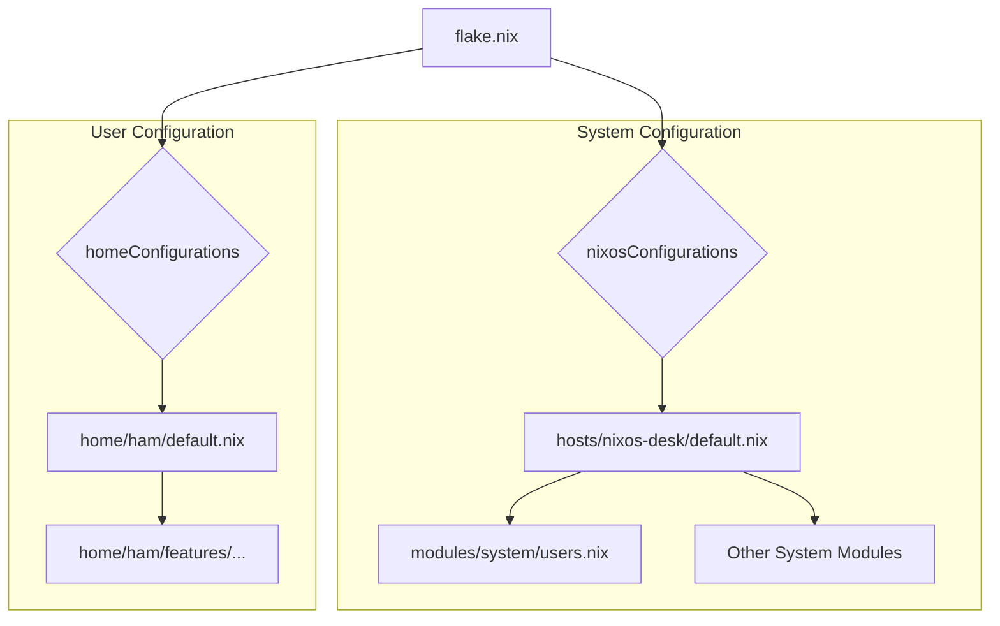

# Architecting a `home-manager` Integration for a Flake-Based NixOS Configuration

## 1. Overview

This document outlines the architectural changes required to integrate `home-manager` into the existing flake-based NixOS configuration. The primary goal is to establish a clear separation of concerns between the system-level configuration (managed by NixOS modules) and user-specific configurations (managed by `home-manager`). This restructuring will lead to a more modular, maintainable, and portable setup.

## 2. Benefits of the New Structure

Integrating `home-manager` provides several key advantages:

*   **Separation of Concerns:** System configurations (`/etc/nixos`) and user dotfiles (`~/.config`) are managed independently. This means you can reinstall your system without losing your personal application settings.
*   **Portability:** Your user environment, including packages, dotfiles, and services, becomes a self-contained, portable unit. You can easily apply your personal configuration to any NixOS machine you use.
*   **Declarative User Environments:** Just as NixOS makes your system configuration declarative, `home-manager` does the same for your user environment. This ensures reproducibility and simplifies management of your personal setup.
*   **Simplified Host Configurations:** Host-specific files no longer need to be concerned with user-level packages or settings, making them cleaner and more focused on the system itself.

## 3. Proposed Directory Structure

The new directory structure will be organized as follows to accommodate `home-manager`:

```
.
├── flake.nix
├── home/
│   ├── ham/
│   │   ├── default.nix
│   │   ├── features/
│   │   │   ├── cli.nix
│   │   │   └── git.nix
│   └── modules/
│       └── ...
├── hosts/
│   ├── nixos-desk/
│   │   └── default.nix
│   └── ...
└── modules/
    ├── system/
    │   ├── users.nix
    │   └── ...
    └── ...
```

### Explanation of New/Changed Files and Directories:

*   **`flake.nix`**: This will be the central point of integration. It will be updated to:
    1.  Add the `home-manager` flake input.
    2.  Create a new `homeConfigurations` output to build the user environments.
    3.  Pass `home-manager`'s modules to the `nixosConfigurations`.

*   **`home/`**: This directory will be dedicated to `home-manager` configurations.
    *   **`home/ham/default.nix`**: This will be the main `home-manager` configuration file for the user `ham`. It will import user-specific features.
    *   **`home/ham/features/`**: This new directory will contain modularized parts of the user's configuration (e.g., `cli.nix`, `git.nix`), making it easier to manage.
    *   **`home/modules/`**: (Optional) For creating your own `home-manager` modules that can be shared across different users.

*   **`hosts/nixos-desk/default.nix`**: Host configurations will be simplified. They will continue to manage system-level concerns but will no longer need to import user-specific configurations like `home/ham.nix`.

*   **`modules/system/users.nix`**: This file will be simplified to only define the user and their system-level properties (like group memberships). All user packages and dotfiles will be moved to the `home-manager` configuration.

## 4. Visualizing the New Architecture

The following diagram illustrates the relationship between the different parts of the new configuration:



## 5. Implementation Steps (High-Level)

1.  **Update `flake.nix`**: Add `home-manager` as an input and create the `homeConfigurations` output.
2.  **Create `home/ham/default.nix`**: Move the contents of the existing `home/ham.nix` into this new file, structuring it as a `home-manager` configuration.
3.  **Refactor `home/ham.nix`**: Split the configuration into smaller, more manageable files within `home/ham/features/`.
4.  **Update `modules/system/users.nix`**: Remove user-specific package definitions.
5.  **Update Host Configurations**: Ensure that host configurations no longer import user-specific files directly.
6.  **Rebuild System**: Run `nixos-rebuild switch --flake .#nixos-desk` to apply the system changes and `home-manager switch --flake .#ham@nixos-desk` to apply the user configuration.

This architectural change will set a solid foundation for a more robust and manageable NixOS setup.