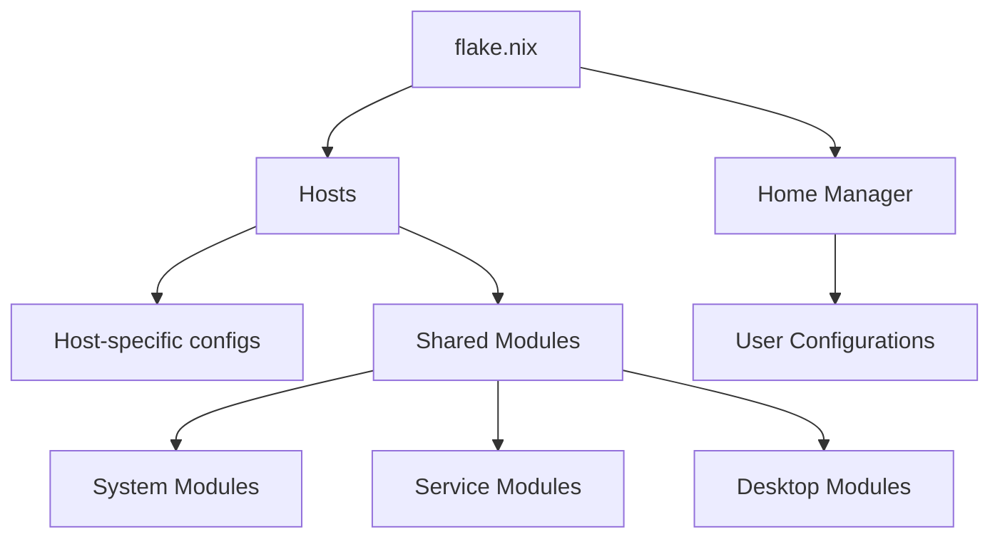

# NixOS Configuration System Patterns

## Architecture Overview

The NixOS configuration is organized using a modular approach with a clear separation of concerns:



## Key Design Patterns

### 1. Host-Based Configuration

Each machine has its own directory under `hosts/` containing:
- A `default.nix` file that imports necessary modules
- A `hardware-configuration.nix` file specific to that machine's hardware

This pattern allows for:
- Machine-specific configurations
- Easy addition of new machines
- Clear separation between hardware and software configuration

### 2. Modular System Components

System components are organized into modules under the `modules/` directory:
- `system/`: Core system configurations (boot, network, users, etc.)
- `services/`: Service configurations (SSH, Docker, etc.)
- `desktop/`: Desktop environment configurations (KDE, etc.)

This pattern enables:
- Reuse of common configurations across machines
- Easy enabling/disabling of components per machine
- Simplified maintenance and updates

### 3. Home Manager Integration

User-specific configurations are managed through Home Manager:
- Each user has their own configuration file under `home/`
- User configurations are referenced in the host configurations

Benefits:
- Separation of system and user configurations
- User-specific package management
- Consistent user environment across machines

### 4. Template-Based Expansion

Templates are provided for adding new hosts and users:
- `hosts/template/`: Template for new host configurations
- `home/template.nix`: Template for new user configurations

This pattern facilitates:
- Consistent structure when adding new components
- Reduced errors when expanding the system
- Faster onboarding of new machines and users

## Implementation Details

### Flake Structure

The `flake.nix` file defines:
- Input sources (nixpkgs, home-manager)
- Output configurations for each host
- Integration of home-manager with each host

### Module Imports

Host configurations import modules using relative paths:
```nix
imports = [
  ./hardware-configuration.nix
  ../../modules/system/boot.nix
  # Additional modules...
];
```

### Configuration Overrides

Host-specific configurations can override defaults from shared modules:
```nix
# Override a default from a shared module
networking.hostName = "nixos-desk";